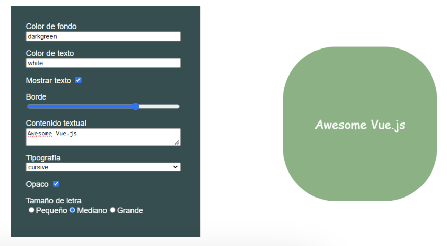

# desafio-templates_y_rendering_en_vue

## Consigna

En este desafío tendremos que crear una aplicación Vue Js desde 0 y maquetar la interfaz que aparece en la imagen.  
Los inputs del formulario deberán modificar los estilos de la figura de la derecha.

### Requerimientos

1. Usar el style binding para asignar estilos reactivamente a un elemento usando valores
del estado.

2. Usar el class binding para asignar clases reactivamente a un elemento usando valores
booleanos del estado.

3. Usar v-for para iterar un arreglo del estado en el template para la renderización
dinámica de elementos.

4. Usar v-show para mostrar u ocultar la figura.

